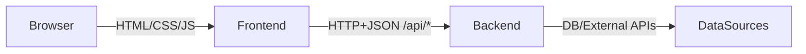
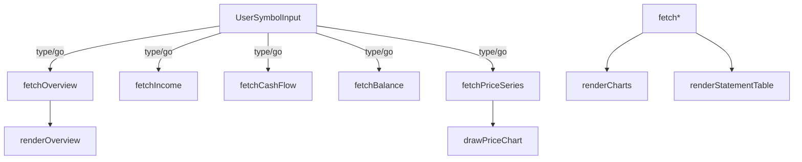
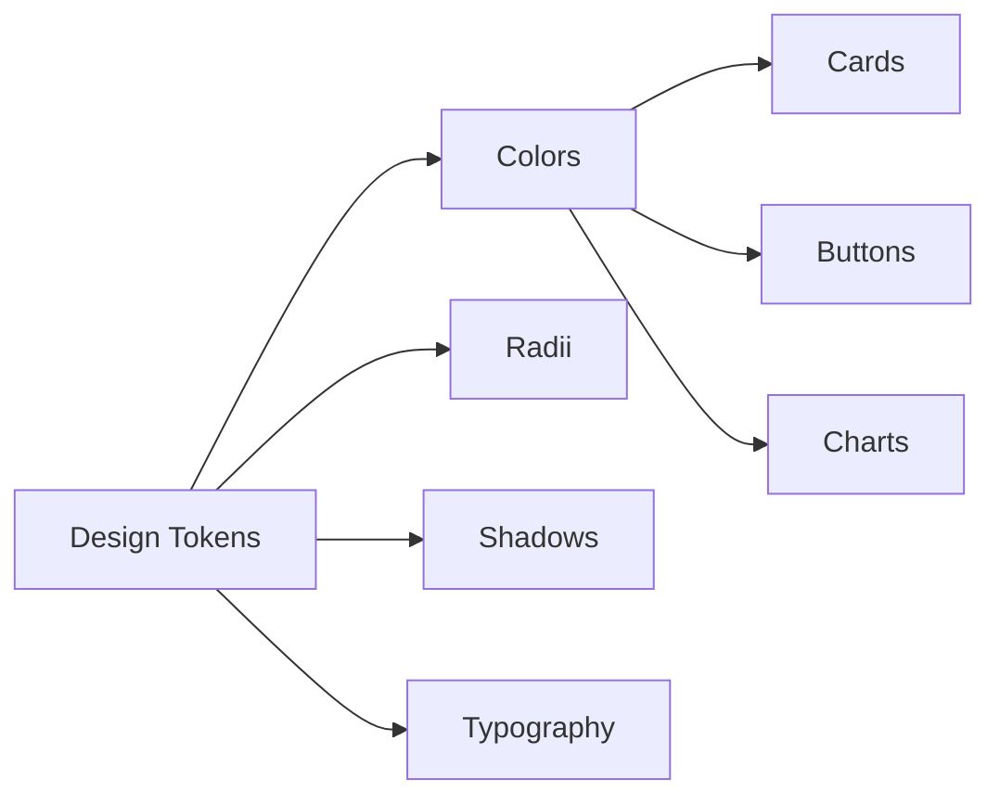
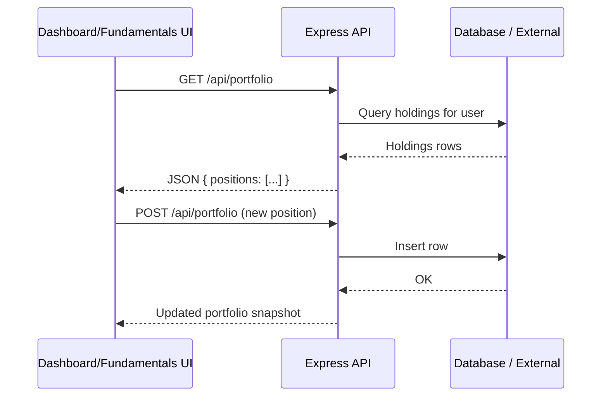

# stockportfolio.pro – Architecture Overview

This document explains how the stockportfolio.pro codebase in `v5/` is organised across the frontend, backend, styling, and data flow.

The focus is the v5 single‑page experience: landing page, dashboard, fundamentals, news and support.

---

## High‑level system

- **Frontend** – vanilla HTML/CSS/JS app under `frontend/`
  - Landing/marketing page (`index.html`)
  - Auth pages (`login.html`, `register.html`)
  - App pages (`dashboard.html`, `fundamentals.html`, `news.html`, `support.html`, `privacy.html`, `terms.html`)
  - Shared JS logic in `script.js`
  - Feature‑specific JS (`fundamentals.js`, `symbol-lookup.js`, `js/login.js`, etc.)
  - Visual styling in `styles.css` plus page‑specific CSS under `css/`
- **Backend** – Express/Node API under `backend/`
  - Authentication, Stripe billing, persistence, and portfolio APIs
  - Served behind `/api` for the frontend

---

## Frontend

### Pages

- `index.html`
  - Marketing landing page for stockportfolio.pro.
  - Uses `css/index.css` and a small `js/index.js` helper for scroll/animation.
  - Contains the “cartoon” illustrations (`Media/cartoon_1.svg` … `cartoon_14.svg`) and feature sections.

- `dashboard.html`
  - Auth‑gated portfolio overview with:
    - KPI “chips” (total value, day change, holdings, YTD)
    - Add Stock form and autocomplete
    - Portfolio line chart and allocation donut (D3)
    - Holdings table with sector pills, gain/loss colouring, and actions.
  - Uses shared `styles.css` and `script.js`.

- `fundamentals.html`
  - Auth‑gated fundamentals workspace with:
    - Symbol search (`symbol-lookup.js`, `fundamentals.js`)
    - Quote panel and price / P/E chart (D3)
    - Overview chips (Market Cap, P/E, EPS, Profit Margin, ROE, ROA, Debt/Equity, Dividend Yield)
    - Revenue, Net Income, Cash Flow, Assets/Liabilities, Cash/Net Debt and Shares charts.
    - Financials tables for Income, Balance, Cash Flow and Ratios.

- `news.html`
  - Auth‑gated news explorer with filters, topics, and a results grid.

- `support.html`, `privacy.html`, `terms.html`
  - Static support and policy pages, styled with the same Aurora Noir theme.

### Shared JS (`script.js`)

Key responsibilities:

- **Auth gating**
  - Computes `PAGE_NAME` from `location.pathname`.
  - Defines `RESTRICTED_PAGES = new Set(['dashboard.html', 'fundamentals.html', 'news.html'])`.
  - If a restricted page is loaded and `localStorage.getItem('token')` is missing, the user is redirected to `login.html?next=...`.
  - `configureNavAuthState()` rewrites guarded nav links (`a[data-guarded]`) to point at `login.html?next=...` when logged out, and restores true URLs when logged in.

- **Navigation state**
  - Toggles compact/mobile navigation using the “hamburger” button (`#toggle-headings`), applying `show-menu` and `show-headings` classes to `<body>`.

- **Sticker / cartoon behaviour**
  - Defines `.sticker.face` blink animation so the “face” stickers occasionally blink.
  - Normalises corrupted glyphs into standard emoji for:
    - Nav buttons (Subscribe, Support, Login, Dashboard, Fundamentals, News, Exit).
    - Card headers in dashboard and fundamentals (Quote, Price, Overview & Charts, etc.).

- **Formatting helpers**
  - Currency/number formatters, trend classes (`gain`, `loss`, `neutral`).
  - Shared tooltip singleton for D3 charts.

See `frontend/styles.css` and `frontend/js` for how these classes are rendered visually.

### Fundamentals JS (`fundamentals.js`)

High‑level flow:

- Uses Alpha Vantage API for:
  - `OVERVIEW`, `INCOME_STATEMENT`, `BALANCE_SHEET`, `CASH_FLOW`, `GLOBAL_QUOTE`, `TIME_SERIES_*`.
- Caches fundamentals per symbol to avoid duplicate network calls.
- Draws charts via D3:
  - Price / P/E chart: gradient area + animated line, crosshair, and tooltip.
  - Column charts for Revenue/Net Income and bar stacks for cash flow and balance sheet.
- Handles basis (Annual/Quarterly) and unit scaling (Auto/Millions/Billions) consistently via helpers like `determineScale()` and `formatPeriodLabel()`.

### Styling (`styles.css` + `css/*.css`)

- Global Aurora Noir theme:

- Key layout primitives:
  - `.navbar`, `.container`, `.card`, `.grid`, `.cartoon-grid`, `.cartoon-panel`.
  - `.chip` and `.kpi-card` for badges and KPI displays.
  - `.holdings-table` with sticky header, striped rows, and tone‑based symbol pills.
  - `.landing-footer` used across landing and app pages.
- Page‑specific CSS:
  - `css/index.css` – landing layout, reveal animation, hero, feature and pricing grids.
  - `css/login.css` and `css/support.css` – auth and support shells.
  - `css/news.css` – news filters and grid.

---

## Backend (high‑level)

> This section describes the typical v5 backend structure; refer to `backend/` files for the exact implementation.

Expected layout:

- `backend/server.js` or `backend/index.js` – Express app bootstrap.
- `backend/routes/*.js` – grouped routers for:
  - `/api/auth` – login, register, token refresh.
  - `/api/portfolio` – CRUD for holdings.
  - `/api/stripe` – billing endpoints (checkout session, webhook).
- `backend/middleware/*.js` – auth middleware, error handling.
- `backend/services/*.js` – integration with external APIs (e.g., Alpha Vantage) and persistence.

Typical request/response flow:

Authentication:

- Frontend stores a JWT or opaque token in `localStorage` (`token`).
- `script.js` uses this token to:
  - Gate restricted pages on the client.
  - Attach it to fetch calls as `Authorization: Bearer <token>` (see specific JS per feature).
- Backend verifies tokens in middleware and attaches `req.user` for downstream handlers.

---

## Data visualisation summary

- **Portfolio line chart (dashboard)** – D3 line + area chart, time‑series of portfolio value with range selector (5D, 1M, 6M, 1Y, 5Y, ALL).
- **Allocation donut (dashboard)** – D3 donut showing per‑ticker or per‑sector allocation; legend uses coloured chips.
- **Price / P/E chart (fundamentals)** – switchable between price and P/E; includes:
  - Gradient underlay
  - Animated line stroke
  - Crosshair and tooltip with formatted currency or P/E.
- **Fundamentals charts** – stacked bars for cash flows, grouped bars for assets/liabilities, simple bars for revenue/net income and shares.

Each chart uses consistent axes styling configured in `styles.css` (`--chart-grid`, `.chart-tooltip`).

---

## Where to look next

- **If you want to tweak visuals** – start with `styles.css` and the relevant `css/*.css` file.
- **If you want to change charts or data** – start with `fundamentals.js` or the D3 helpers in `script.js`.
- **If you want to adjust auth or navigation** – see `script.js` for client gating and `backend/` for server‑side enforcement.

